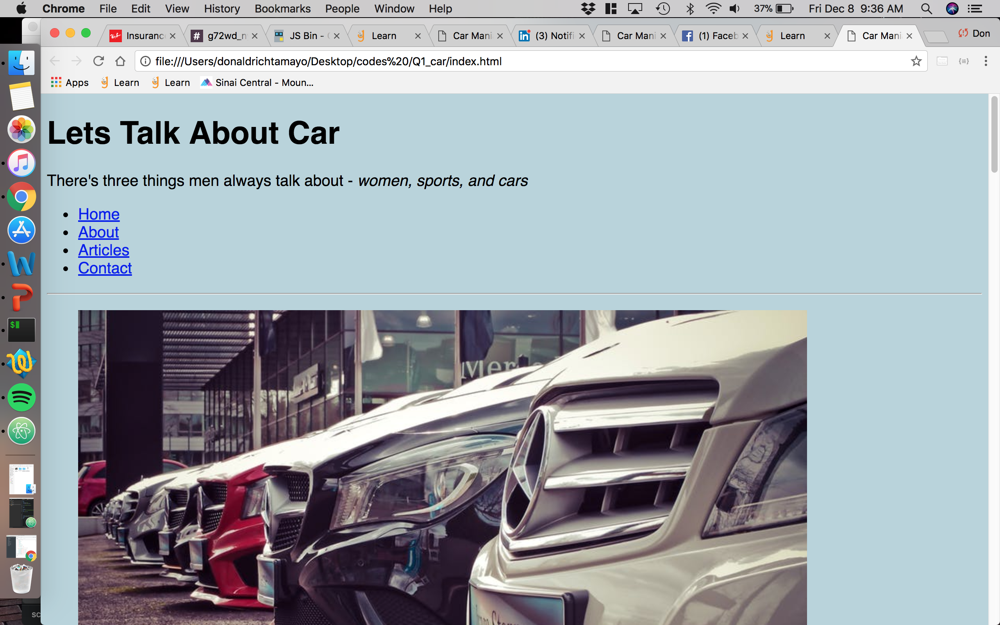
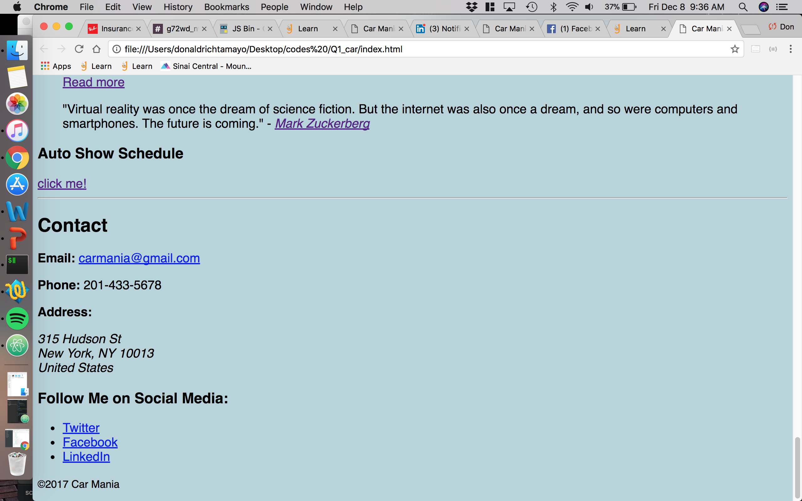
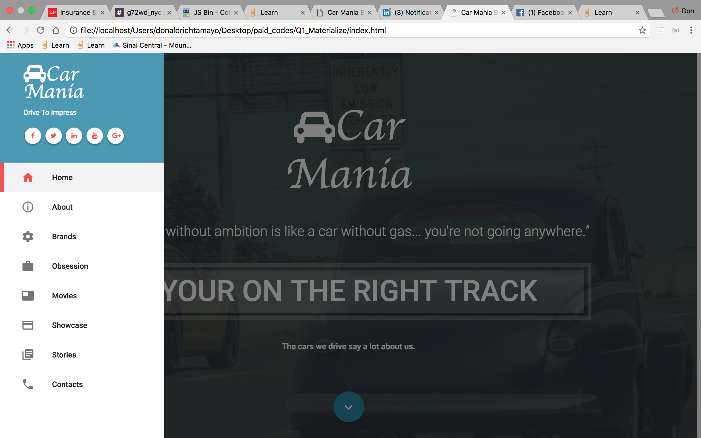
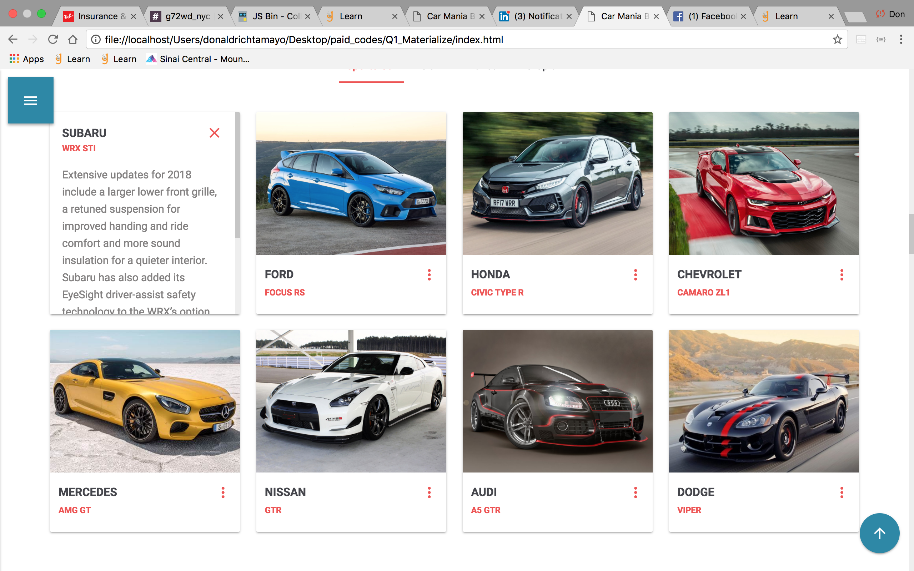
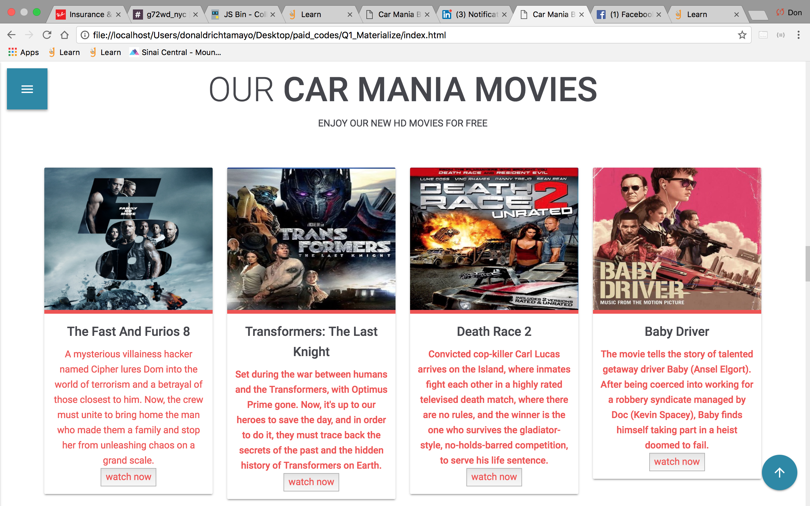
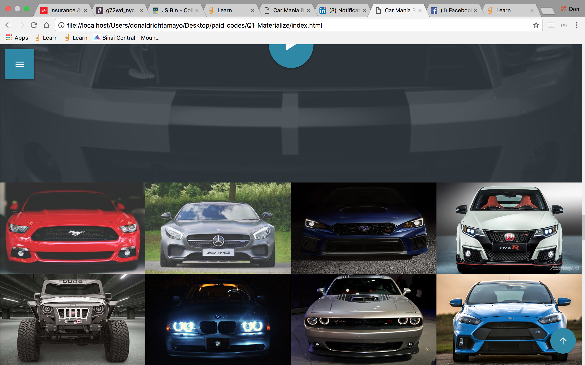
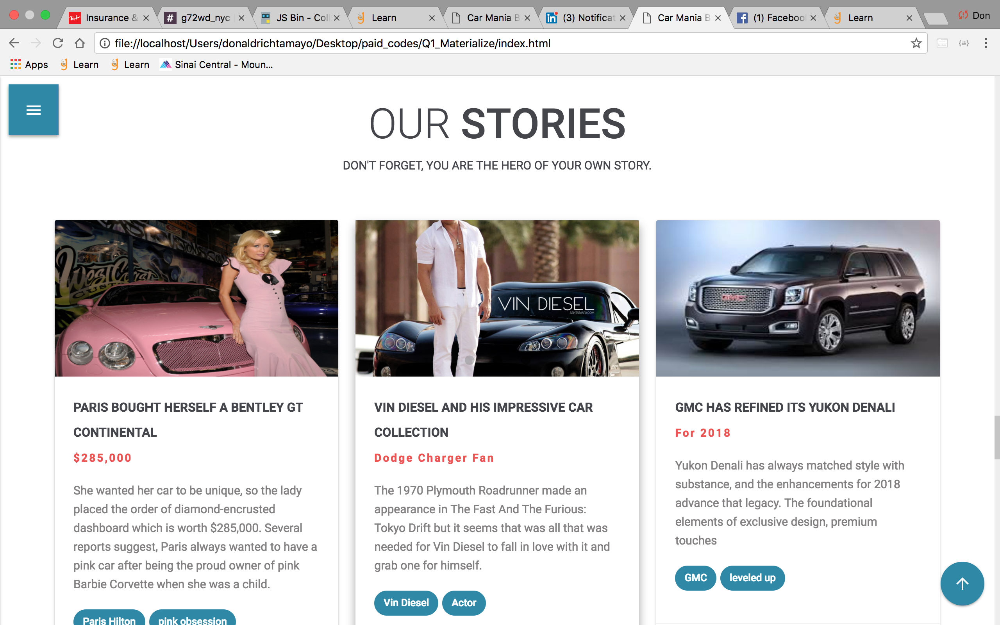
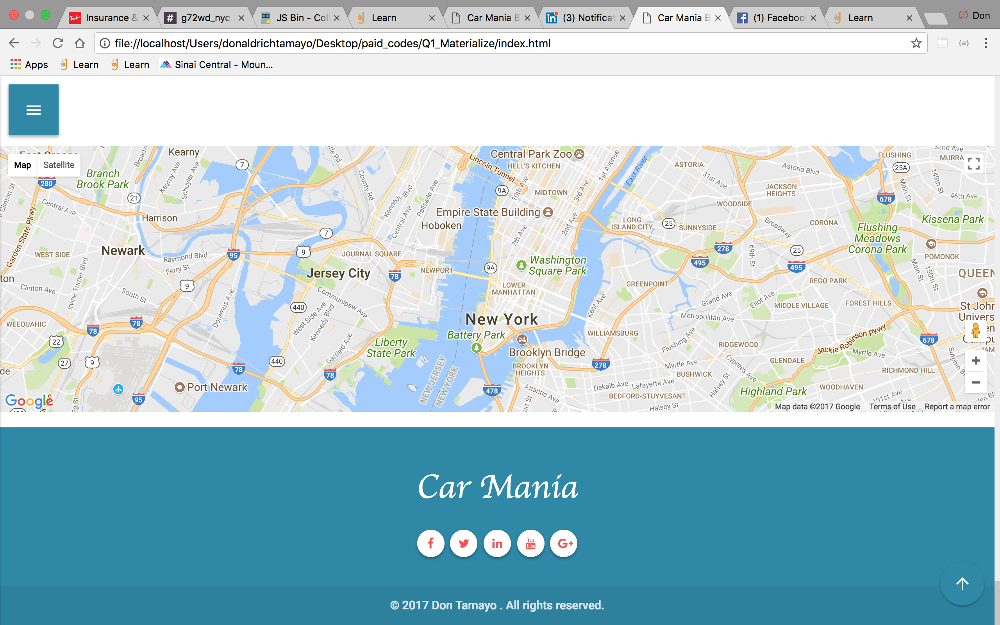

# Q1_cars_ CARMANIA

##  This project  is  dedicated for my Q1 project 2017.
####  Deployment  Date: 12 / 07 / 2017

##### objective:
-  create a website for car slides
-  group them into each class
-  link it to affiliate marketing
 - use API for car shows nearby
- connect to people that share the same interest.

related websites:
**http://obsessedgarage.com/**

1.   So I started with basic html and css quite fun at first but putting all the boxes in order always crushed my site.

  

2. still basic html, nothing to show off! and i begun panicking because i cant get it through grid css and flex box.

  

3. Now i'm using materializecss for everything, its save a lot of my frustration and the fun just begun.

4.  this is when i put so much effort on my boxes and got stuck how i put it the right spot but i works after all plus seeing this amazing cars help me to relieved the stress.

5. And i put some of the rated and top movies related to car obsession.  "You can hang out to my site as long as you want!"

6. Here comes the angry front views of my selected cars.  the javascript on this is quite simple and challenging.

7. Some related stories! i linked it to some site available just in case you want to read more about the topic.  the goal is to create my own blog stories in the future.

8. Lastly you can contact us, visit us, and be part of the car mania people.

### Car Mania 2017
